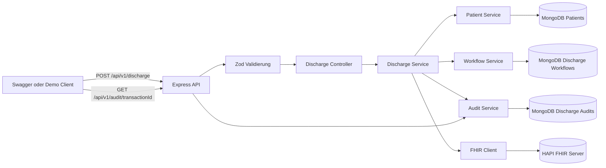
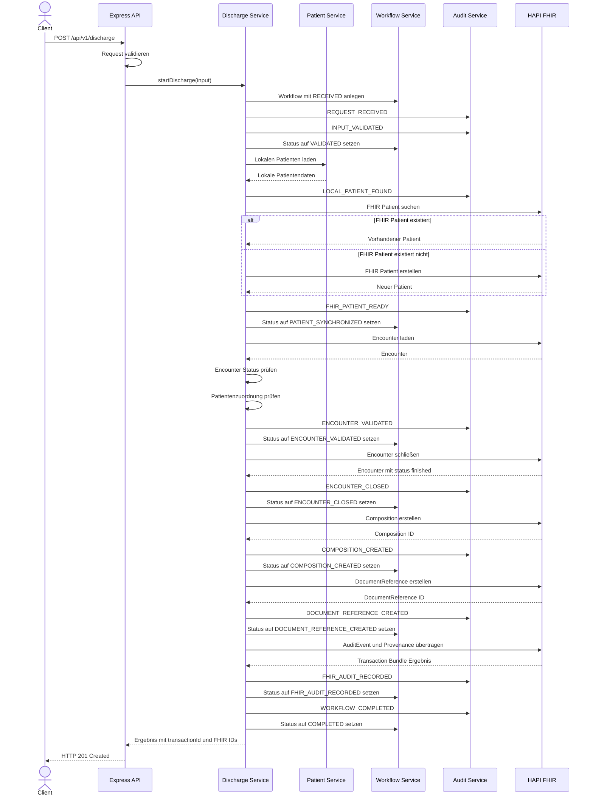
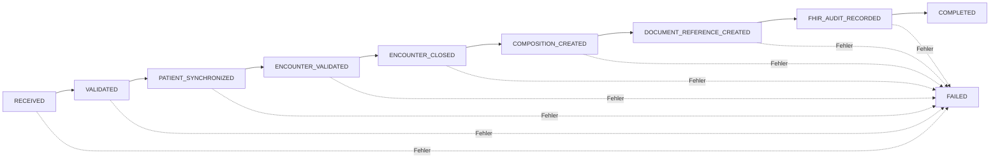

# Architektur des Entlassungsworkflows

## Ziel

Der Entlassungsworkflow bildet einen vollständigen Entlassungsprozess ab.

Dabei werden:

- lokale Patientendaten geladen,
- FHIR-Ressourcen geprüft und erstellt,
- der Encounter abgeschlossen,
- ein Entlassungsdokument erzeugt,
- Audit-Informationen gespeichert,
- der aktuelle Workflowstatus in MongoDB persistiert.

Der Prozess ist über eine eindeutige `transactionId` nachvollziehbar.

## Beteiligte Komponenten

Der Entlassungsworkflow besteht aus folgenden Komponenten:

### Express API

Die Express API stellt die HTTP-Endpunkte bereit:

```text
POST /api/v1/discharge
GET /api/v1/audit/{transactionId}
```

Die API übernimmt:

- Authentifizierung und Scope-Prüfung,
- Request-Validierung,
- Weiterleitung an den Controller,
- standardisierte Erfolgs- und Fehlerantworten.

### Discharge Controller

Der Controller nimmt den bereits validierten Request entgegen und ruft den Discharge Service auf.

Der Controller enthält keine eigentliche Geschäftslogik.

### Discharge Service

Der Discharge Service orchestriert den gesamten Ablauf.

Er übernimmt unter anderem:

- Laden des lokalen Patienten,
- Synchronisation des FHIR-Patienten,
- Prüfung des Encounters,
- Abschluss des Encounters,
- Erstellung der Composition,
- Erstellung der DocumentReference,
- Erstellung von AuditEvent und Provenance,
- Aktualisierung des Workflowstatus,
- Speicherung lokaler Audit-Einträge.

### Patient Service

Der Patient Service lädt den lokalen Patienten aus MongoDB.

Die lokale Patienten-ID wird außerdem als Identifier für den FHIR-Patienten verwendet.

### FHIR Client

Der FHIR Client kapselt die Kommunikation mit dem HAPI-FHIR-Server.

Er stellt unter anderem Funktionen bereit für:

- Patientensuche,
- Patientenerstellung,
- Laden eines Encounters,
- Abschluss eines Encounters,
- Erstellung einer Composition,
- Erstellung einer DocumentReference,
- Übertragung eines Transaction Bundles.

### Audit Service

Der Audit Service speichert einzelne Verarbeitungsschritte in MongoDB.

Für jeden Schritt wird ein eigener Audit-Eintrag angelegt.

### Workflow Service

Der Workflow Service speichert den aktuellen Gesamtzustand eines Entlassungsvorgangs.

Er kontrolliert außerdem, ob ein Statusübergang erlaubt ist.

### MongoDB

MongoDB speichert:

- lokale Patienten,
- einzelne Audit-Einträge,
- den aktuellen Zustand jedes Entlassungsworkflows.

### HAPI FHIR

HAPI FHIR speichert die medizinischen FHIR-Ressourcen.

Dazu gehören:

- Patient,
- Encounter,
- Composition,
- DocumentReference,
- AuditEvent,
- Provenance.

## Systemübersicht



## Verarbeitung des Requests

Der Request für den Entlassungsworkflow enthält:

- Patienten-ID,
- Encounter-ID,
- Diagnosen,
- Prozeduren,
- Medikamente,
- Angaben zur Weiterbehandlung.

Die Eingabe wird vor dem Aufruf des Discharge Service über ein Zod-Schema validiert.

Bei einem ungültigen Request wird der Ablauf vor dem Start des eigentlichen Workflows beendet.

Beispiel:

```json
{
  "patient": {
    "patientId": "78749379-515f-4c79-ac90-884979029ffa"
  },
  "encounter": {
    "encounterId": "123"
  },
  "diagnoses": [
    {
      "code": "I10",
      "display": "Essentielle Hypertonie"
    }
  ],
  "procedures": [],
  "medications": [
    {
      "name": "Ramipril",
      "dosage": "5 mg morgens"
    }
  ],
  "followUp": {
    "type": "Hausärztliche Weiterbehandlung",
    "date": "2026-07-27",
    "notes": "Blutdruckkontrolle"
  }
}
```

## Ablauf des Entlassungsworkflows



## Workflowstatus

Der aktuelle Gesamtzustand des Workflows wird in der MongoDB-Collection gespeichert:

```text
dischargeworkflows
```

Mögliche Zustände sind:

```text
RECEIVED
VALIDATED
PATIENT_SYNCHRONIZED
ENCOUNTER_VALIDATED
ENCOUNTER_CLOSED
COMPOSITION_CREATED
DOCUMENT_REFERENCE_CREATED
FHIR_AUDIT_RECORDED
COMPLETED
FAILED
```

Der normale Ablauf lautet:



Ein erfolgreicher Workflow besitzt am Ende ungefähr folgenden Zustand:

```json
{
  "transactionId": "TRANSACTION-ID",
  "patientId": "LOKALE-PATIENTEN-ID",
  "encounterId": "FHIR-ENCOUNTER-ID",
  "status": "COMPLETED",
  "fhirPatientId": "FHIR-PATIENTEN-ID",
  "compositionId": "FHIR-COMPOSITION-ID",
  "documentReferenceId": "FHIR-DOCUMENT-REFERENCE-ID",
  "completedAt": "2026-07-21T12:00:00.000Z"
}
```

## Audit-Trail

Die einzelnen Verarbeitungsschritte werden in der MongoDB-Collection gespeichert:

```text
dischargeaudits
```

Ein erfolgreicher Ablauf enthält folgende Schritte:

```text
REQUEST_RECEIVED
INPUT_VALIDATED
LOCAL_PATIENT_FOUND
FHIR_PATIENT_READY
ENCOUNTER_VALIDATED
ENCOUNTER_CLOSED
COMPOSITION_CREATED
DOCUMENT_REFERENCE_CREATED
FHIR_AUDIT_RECORDED
WORKFLOW_COMPLETED
```

Der Audit-Trail kann über folgenden Endpunkt geladen werden:

```text
GET /api/v1/audit/{transactionId}
```

Workflowstatus und Audit-Trail erfüllen unterschiedliche Aufgaben.

Der Workflowstatus beantwortet:

> In welchem Gesamtzustand befindet sich der Entlassungsvorgang?

Der Audit-Trail beantwortet:

> Welche Verarbeitungsschritte wurden wann durchgeführt?

## Erzeugte FHIR-Ressourcen

### Patient

Der lokale Patient wird über einen eindeutigen Identifier auf dem FHIR-Server gesucht.

Das Identifier-System lautet:

```text
urn:medinfo:patient-id
```

Existiert noch kein passender FHIR-Patient, wird ein neuer Patient erstellt.

### Encounter

Der Encounter wird anhand seiner FHIR-ID geladen.

Vor dem Abschluss wird geprüft:

- ob der Encounter existiert,
- ob er noch nicht den Status `finished` besitzt,
- ob er dem angegebenen FHIR-Patienten zugeordnet ist.

Nach erfolgreicher Prüfung wird der Status auf folgenden Wert gesetzt:

```text
finished
```

### Composition

Die Composition bildet den strukturierten Entlassungsbrief ab.

Sie enthält Abschnitte für:

- Diagnosen,
- Prozeduren,
- Medikation,
- Weiterbehandlung.

### DocumentReference

Die DocumentReference verweist auf das erzeugte Entlassungsdokument.

Der Text des Entlassungsbriefs wird Base64-kodiert an den FHIR-Server übertragen.

### AuditEvent

Das AuditEvent dokumentiert die Erstellung des Entlassungsdokuments innerhalb des FHIR-Systems.

### Provenance

Die Provenance dokumentiert die Herkunft beziehungsweise Erstellung der DocumentReference.

AuditEvent und Provenance werden gemeinsam in einem FHIR Transaction Bundle übertragen.

## Erfolgsantwort

Ein erfolgreicher Ablauf liefert:

```text
HTTP 201 Created
```

Beispiel:

```json
{
  "transactionId": "TRANSACTION-ID",
  "status": "COMPLETED",
  "patientId": "LOKALE-PATIENTEN-ID",
  "encounterId": "FHIR-ENCOUNTER-ID",
  "fhir": {
    "patientId": "FHIR-PATIENTEN-ID",
    "compositionId": "FHIR-COMPOSITION-ID",
    "documentReferenceId": "FHIR-DOCUMENT-REFERENCE-ID"
  },
  "completedAt": "2026-07-21T12:00:00.000Z"
}
```

## Fehlerbehandlung

Bei einem Fehler innerhalb des gestarteten Workflows werden folgende Aktionen ausgeführt:

1. Der Workflowstatus wird auf `FAILED` gesetzt.
2. Der fehlgeschlagene Verarbeitungsschritt wird gespeichert.
3. Der Fehlercode wird im Workflow gespeichert.
4. Ein Audit-Eintrag `WORKFLOW_FAILED` wird angelegt.
5. Die `transactionId` wird in der Fehlerantwort ausgegeben.

Beispiel:

```json
{
  "error": {
    "code": "ENCOUNTER_PATIENT_MISMATCH",
    "message": "Encounter does not belong to the specified patient",
    "requestId": "REQUEST-ID",
    "details": {
      "transactionId": "TRANSACTION-ID",
      "failedStep": "FHIR_ENCOUNTER_LOOKUP"
    }
  }
}
```

Der Client kann die zurückgegebene `transactionId` anschließend für die Audit-Abfrage verwenden.

## Fehlerfälle

### Patient nicht gefunden

Der lokale Patient existiert nicht.

Mögliche Antwort:

```text
404 Not Found
```

### Encounter nicht gefunden

Der angegebene FHIR-Encounter existiert nicht.

Fehlercode:

```text
ENCOUNTER_NOT_FOUND
```

### Encounter bereits abgeschlossen

Der Encounter besitzt bereits den Status `finished`.

Fehlercode:

```text
ENCOUNTER_ALREADY_FINISHED
```

### Falsche Patientenzuordnung

Der Encounter gehört nicht zum angegebenen Patienten.

Fehlercode:

```text
ENCOUNTER_PATIENT_MISMATCH
```

### FHIR-Server nicht erreichbar

Eine FHIR-Operation kann nicht ausgeführt werden.

Fehlercode:

```text
FHIR_SERVICE_ERROR
```

### Ungültiger Request

Der Request entspricht nicht dem Validierungsschema.

Fehlercode:

```text
VALIDATION_ERROR
```

Bei einem Validierungsfehler vor dem Serviceaufruf wird noch kein Entlassungsworkflow erzeugt.

## Lokale Persistenz

### Patientendaten

Collection:

```text
patients
```

### Workflowstatus

Collection:

```text
dischargeworkflows
```

Ein Dokument pro Entlassungsvorgang.

### Audit-Einträge

Collection:

```text
dischargeaudits
```

Mehrere Dokumente pro Entlassungsvorgang.

Die Zuordnung erfolgt über die gemeinsame:

```text
transactionId
```

## Sicherheitsmechanismen

Die Endpunkte verwenden unterschiedliche Berechtigungen.

Für das Starten einer Entlassung wird folgender Scope benötigt:

```text
discharge:write
```

Für das Lesen des Audit-Trails wird folgender Scope benötigt:

```text
audit:read
```

Zusätzlich verwendet die API:

- Request-IDs,
- standardisierte Fehlerantworten,
- zentrale Validierung,
- Security Header,
- CORS-Prüfung,
- Rate Limiting.

## Bekannte Einschränkungen

Der aktuelle Workflow unterstützt keine automatische Wiederaufnahme eines fehlgeschlagenen Vorgangs.

Es existiert derzeit:

- kein automatischer Rollback bereits ausgeführter FHIR-Schritte,
- keine clientseitige Idempotency-ID,
- keine automatische Fortsetzung ab dem letzten erfolgreichen Schritt.

Schlägt beispielsweise die Erstellung der DocumentReference fehl, nachdem der Encounter bereits geschlossen wurde, bleibt der Encounter geschlossen.

Der Workflowstatus und der Audit-Trail machen diesen Zustand nachvollziehbar, korrigieren ihn aber nicht automatisch.

Diese Funktionen sind mögliche Erweiterungen für einen produktiven Betrieb.

## Ergebnis

Die Architektur stellt sicher, dass:

- der komplette Entlassungsprozess zentral orchestriert wird,
- medizinische FHIR-Ressourcen erzeugt werden,
- der Encounter abgeschlossen wird,
- jeder Verarbeitungsschritt lokal nachvollziehbar ist,
- der aktuelle Gesamtstatus gespeichert wird,
- Fehler einer eindeutigen Transaktion zugeordnet werden können,
- der Ablauf über Swagger demonstrierbar ist.

Damit ist der Entlassungsworkflow sowohl technisch ausführbar als auch fachlich dokumentiert.
